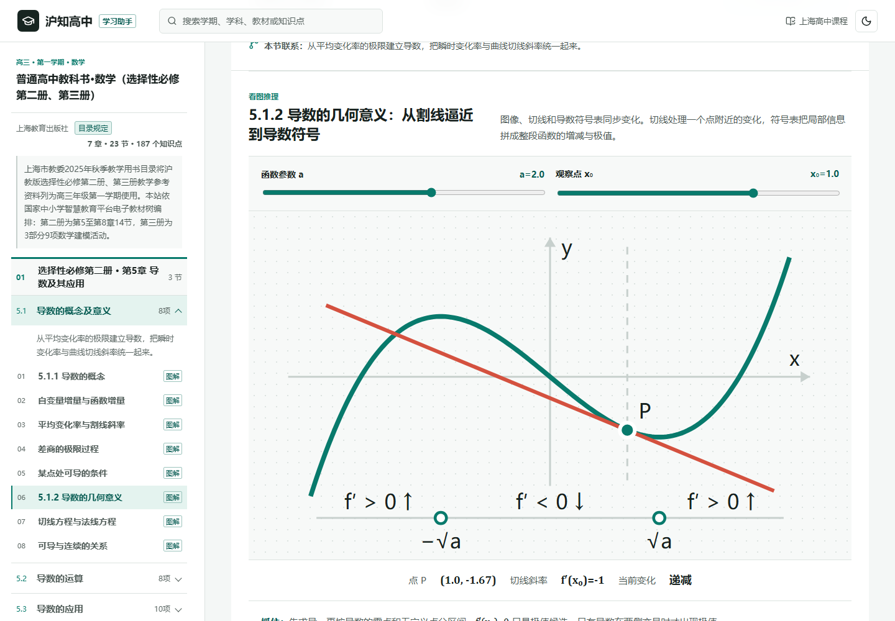

# 沪知高中

面向上海高中学习场景的学习辅助网站。课程按“学期 -> 学科 -> 教材章节 -> 课节 -> 知识点”组织；尚未逐章录入的课程沿用教材主题单元目录。网站覆盖高一上至高三下六个学期、十个学科和 2,392 个可检索知识点。教材学习、知识检索和专题复习是主体，互动实验是部分知识点的辅助呈现方式。



## 课程结构

- 六个学期：高一上、高一下、高二上、高二下、高三上、高三下
- 十个学科：语文、数学、英语、物理、化学、生物学、思想政治、历史、地理、信息技术
- 教材层级目录：数学六学期均按章节和课节展开；高一上至高三上依次核对沪教版必修第一至第四册、选择性必修第一至第三册，高三下明确组织为专题复习而非新授教材
- 完整知识课文：每个知识点均包含核心概念、两段展开说明、三步推理、具体例题、自检答案和针对性误区
- 数学可视化讲解：六学期 990 个数学知识点全部接入主题匹配的动态示意、图像联动或可操作图解，覆盖函数、三角、向量、复数、数列、解析几何、立体几何、导数、计数、概率分布、统计推断和数学建模
- 多层次辅助形式：27 个通用互动演示与完整课文同时出现；其他知识点使用学科专用的结构、过程、关系或时序图解
- 全局搜索：可检索学期、学科、教材、单元、概念正文、推理步骤、例题和自检内容
- 移动端目录：学期、学科横向选择，教材目录使用抽屉展开

课程整理进度和逐科检查项见 [CURRICULUM_TODO.md](CURRICULUM_TODO.md)。

## 教材依据

教材分配优先依据上海市教育委员会发布的教学用书目录：

- [2025年秋季中小学教学用书目录](https://edu.sh.gov.cn/mbjy_fgwx_qt/20250815/a8a2ddc32dce4701af24f663381cf45c.html)
- [2025年春季中小学教学用书目录](https://edu.sh.gov.cn/xxgk2_zdgz_jcjy_04/20241217/785c6246825a444caf42d692509cc413.html)
- [国家中小学智慧教育平台教材目录](https://basic.smartedu.cn/tchMaterial)

站内优先按教材目录整理知识点，便于同步学习、检索、演示和跨章节联系；尚未完成逐章核对的课程以核心主题组织。网站不对应原书逐页内容，也不替代教材原文、学校教学计划或考试说明。

需要特别注意：

- 英语目录提供上海教育出版社、上海外语教育出版社两种版本，由学校选一种使用；站内按共同语言能力整合。
- 生物学、地理和信息技术的部分选择性必修教材在目录中只标注“高中”或“高二年级”，具体开设学期由学校和学生选科方案决定。
- 高一下历史没有目录指定的新授教材，站内标为上册巩固、地方史和世界史衔接的建议方案。
- 高三下没有虚构统一新授教材，十个学科均明确标为专题复习方案。

## 本地运行

```bash
npm install
npm run dev
```

代码检查、生产构建和浏览器测试：

```bash
npm run lint
npm run build
npm run test:e2e
```

端到端测试覆盖六学期数学教材结构、逐知识点讲解深度、知识族路由、关键图解交互、全部通用演示、跨学期搜索、1440/390/320px 布局，以及浅色和深色模式的 WCAG 2 A/AA 检查。其余五学期的 963 个数学知识点另经过三种视口逐项打开和控件极值验收。

## 技术栈

React 19、TypeScript、Vite、Lucide Icons、Playwright 和 axe-core。互动图形由浏览器原生 SVG、HTML 与 CSS 实现，无后端依赖。

## License

MIT
